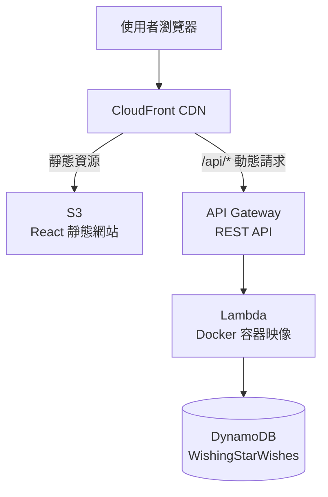
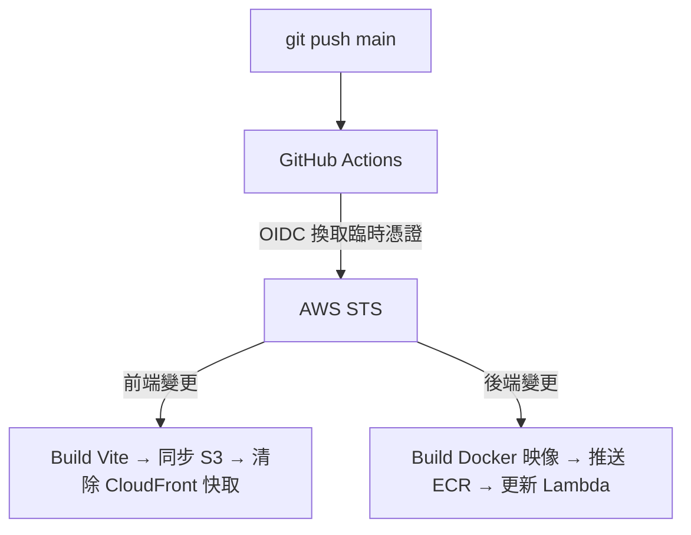

# Wishing-star

前後端用 GitHub Actions 自動部署(CI/CD)到 AWS，全程使用 OIDC 免存放金鑰，完成：

- 完整雲原生（cloud-native）架構
- 最小權限設計
- 免金鑰 CI/CD
- 費用管理
- 資安防護

並記錄一些異常排查（詳見下方踩雷經驗）

## 技術列表

| 分類 | 技術 |
|---|---|
| 前端 | React + Vite |
| 後端 | Node.js + Express |
| 容器化 | Docker（Lambda 專用 base image） |
| AWS服務 | S3、CloudFront、API Gateway、Lambda、DynamoDB、ECR |
| CI/CD | GitHub Actions + AWS OIDC（無存放金鑰） |
| 本機開發 | Docker Compose（DynamoDB Local + 資料檢視 GUI） |

## 上雲架構 (AWS)



- **CloudFront + S3（OAC）**：靜態網站託管，S3 本身不公開，只信任 CloudFront 存取
- **API Gateway（REST API）**：`{proxy+}` 萬用路由，把所有請求轉給 Lambda 處理
- **Lambda（容器映像，ARM64）**：Express app 包一層 [`serverless-http`](https://github.com/dougmoscrop/serverless-http)，本機開發與雲端部署共用同一份程式碼
- **DynamoDB（On-Demand）**：單一資料表，依請求量計費，低流量下幾乎是 $0


## CI/CD 流程



- 前後端各自獨立的 workflow，用 `paths` 過濾，只有相關資料夾有變動才觸發
- 用 `aws-actions/configure-aws-credentials` 搭配 IAM OIDC 身份提供者，**不儲存任何長期 Access Key**
- IAM 信任政策精準限定到「這個 repo、這個 workflow 檔案、main 分支」才能取得部署權限
- GitHub Actions 需要的 Secret：
  - `AWS_DEPLOY_ROLE_ARN`：要 assume 的部署用 IAM Role ARN，OIDC 換到臨時憑證後用這個角色操作 AWS 資源
  - `S3_BUCKET`：前端靜態網站託管的 S3 bucket 名稱，`aws s3 sync` 會同步到這裡
- GitHub Actions 需要的 Variables：
  - `VITE_API_URL`：build 前端時注入的正式環境 API 網址，讓打包後的靜態頁面知道要打哪個 API Gateway
  - `CLOUDFRONT_DISTRIBUTION_ID`：前端部署完後要清快取的 CloudFront distribution ID
  - `ECR_REPOSITORY`：後端 Docker 映像要推送到的 ECR repository 名稱
  - `LAMBDA_FUNCTION_NAME`：部署後要更新映像／環境變數的 Lambda function 名稱
  - `TABLE_NAME`：Lambda 環境變數，指定要連線的正式 DynamoDB 資料表名稱
  - `ALLOWED_ORIGIN`：Lambda 環境變數，CORS 只允許這個來源網域的請求

## 資料夾結構

```
wishing-star/
├── .github/workflows/  ← CI/CD（deploy-frontend.yml / deploy-backend.yml）
├── frontend/     ← 前端
├── backend/      ← 後端
└── README.md     ← 這份文件
```

## 本機開發

1. **後端**：進入 `backend/` 資料夾，依照 `backend/README.md` 的步驟啟動
2. **前端**：進入 `frontend/` 資料夾，依照 `frontend/README.md`的步驟啟動

後端本機用 Docker 跑一個 DynamoDB Local，前端指向本機 API，跟雲端部署共用同一套邏輯。

## 資安設計

- **最小權限 IAM**：Lambda 執行角色、部署角色的權限都收斂到「這個資源、這幾個動作」，不用官方 FullAccess 政策
- **免金鑰 CI/CD**：GitHub Actions 透過 OIDC 取得臨時憑證，帳號裡不存在任何長期有效的 Access Key
- **CORS 限制**：API 只接受來自正式網域的請求，不是萬用 `*`
- **雙層節流保護**：API Gateway 節流 + Lambda 並行執行數限制，避免被異常流量灌爆
- **費用警報**：AWS Budgets 設定超額通知，帳單失控前就會先收到信
- **Root 帳號 MFA**：不用長期存取金鑰操作日常事務

## 踩雷經驗

### 1. CloudFront + S3 一直回傳 `AccessDenied`

**症狀**：Origin Access Control（OAC）都設定好了，bucket policy 也貼上了，打開網站還是 `AccessDenied`。

**根因**：CloudFront 的「預設根物件（Default root object）」沒填。訪問根目錄 `/` 時，CloudFront 不知道要去 S3 抓哪個檔案，S3 + OAC 這個組合下，這種情況回傳的是容易誤導人的 `AccessDenied`，而不是更直覺的 404。

**解法**：CloudFront distribution 的一般設定裡，把 Default root object 填 `index.html`。

**後來又踩了第二次**：搬遷資源、換新 S3 bucket 當 origin 時，CloudFront 提示要貼的新 bucket policy 忘記真的存檔，同一個症狀又出現一次。**教訓：每次換 origin，一定要親眼確認新 bucket 的 policy 真的存進去了，不能只是複製、沒貼上就跳過。**

### 2. Lambda 容器映像推上去了，部署卻報錯「media type ... is not supported」

**根因**：新版 Docker Desktop 底層改用 `buildx`/`containerd`，預設會在建置的映像裡多包一層 OCI 標準的「來源證明（provenance）」與「SBOM」中繼資料清單。這種格式技術上合規，但 **Lambda 目前不支援這種多層 manifest**。

**解法**：建置時明確關掉這兩項：

```bash
docker buildx build --provenance=false --sbom=false -t your-image .
```

### 3. GitHub Actions 的 OIDC 驗證持續失敗：`Not authorized to perform sts:AssumeRoleWithWebIdentity`

這是整個專案裡花最久時間排查的問題。信任政策、OIDC 提供者、Secret 內容（連雜湊值都比對過）、分支名稱、區域，全部驗證過都正確，角色刪掉重建、OIDC 提供者刪掉重建，結果依然一樣。

**根因**：GitHub 更新了 OIDC token 的 `sub` claim 格式，現在會把帳號與 repo 的**不可變數字 ID** 直接嵌入字串裡，例如：

```
repo:{github-user-account}@{github-user-id}/{repo-name}@{repo-id}:ref:refs/heads/main
```

而不是舊版單純的 `repo:owner/reponame:ref:refs/heads/main`。信任政策用舊格式去比對，永遠對不上，卻又幾乎找不到明確的錯誤原因——AWS 端只會回一個通用的 `AccessDenied`。

**怎麼查出來的**：用 CloudTrail 的事件歷史記錄，篩選 `AssumeRoleWithWebIdentity`，展開失敗事件的 JSON，`userIdentity.userName` 欄位裡就是 AWS 實際收到、拿去比對的完整 `sub` 值——這是唯一比 GitHub Actions log 更誠實的資訊來源。

**解法**：信任政策加上id

- 查 github-user-id: https://api.github.com/users/{github-user-account}
- 查 repo-id: https://api.github.com/repos/{github-user-account}/{repo-name}

```json
"Condition": {
    "StringEquals": {
        "token.actions.githubusercontent.com:sub": "repo:{github-user-account}@{github-user-id}/{repo-name}@{repo-id}:ref:refs/heads/main"
    }
}
```

### 4. ECR 登入成功、影像建置成功，push 卻回傳 `403 Forbidden`

**根因**：IAM 政策只給了 `ecr:PutImage`、`ecr:InitiateLayerUpload` 這類「上傳」動作，但 Docker push 前會先做一次 `HEAD` 檢查，確認有沒有已存在的映像層可以重複利用，這個檢查動作需要 `ecr:BatchGetImage` 和 `ecr:GetDownloadUrlForLayer` 這兩個「讀取」權限，一開始漏掉了。

**解法**：ECR 推送相關的 IAM 政策，讀取和寫入的動作要一起給，不能只給寫入。

### 5. `update-function-configuration` 會把環境變數整個洗掉

**根因**：這個 API 呼叫的 `--environment` 參數不是「合併」，是「整個取代」。只給一個新變數，Lambda 上其他原本設定好的環境變數會直接消失。

**解法**：每次呼叫都要把**所有**需要的環境變數一次帶齊，不能分批給。


